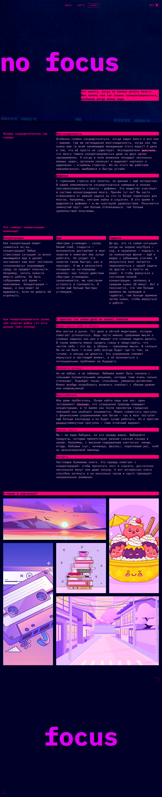
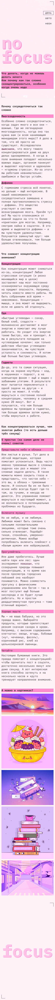

# Вёрстка макета

Учебный проект — вёрстка веб-страницы по дизайн-макету.  
Проект выполнен в рамках обучения и направлен на отработку навыков HTML и CSS и адаптивной верстки с наличием разных цветовых тем.

## 🛠 Используемые технологии
- HTML5  
- CSS3  
- Flexbox / Grid  
- JavaScript
- Адаптивная верстка

## 📄 Описание
В проекте реализована вёрстка страницы в соответствии с предоставленным дизайн-макетом.  
Основное внимание уделялось:
- корректной структуре HTML-разметки;
- соблюдению отступов, размеров и типографики;
- аккуратному и читаемому CSS-коду.

## 🖼 Скриншоты проекта в разных цветовых темах

Благодарность компании Яндекс за предоставленный дизайн

https://github.com/DvachedTrip/slozhno-sosredotochitsya-fd.git
